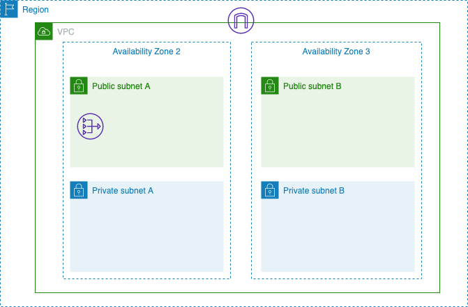

# AWS Fargate - CloudFormation Templates

CloudFormation templates for launching an ECS Cluster with a Fargate Service

## Key Files

```
.
+-- Infra
|   +-- NetworkCFT.yml 
|   +-- IAMRoleProvisioning.yml
+-- Application
|   +-- ECSClusterCFT.yml
```

### 1. Network (NetworkCFT.yml)

Create a VPC Network with a pair of paired subnets

Run: aws cloudformation create-stack --stack-name abCFNetworkStack --template-body file://Infra/NetworkCFT.yml

#### [Topology](Infra/NetworkCFT.yml):


### 2. IAM Roles for ECS (IAMRoleProvisioningCFT.yml)

Create the ECS Task Execution Role

Run: aws cloudformation create-stack --stack-name abCFIAMRoles --capabilities CAPABILITY_NAMED_IAM --template-body file://Infra/IAMRoleProvisioningCFT.yml

### 3. ECS Artifacts (ECSClusterCFT.yml)

Create a the artifacts for the ECS Cluster:
* Application Load Balancer incl SG and Target Groups
* ECS Service
* ECS Task Definition - Fargate based
* ECS Service

Run: aws cloudformation create-stack --stack-name abECSStack --template-body file://Application/ECSClusterCFT.yml

#### [Final Topology](Application/ECSClusterCFT.yml):
